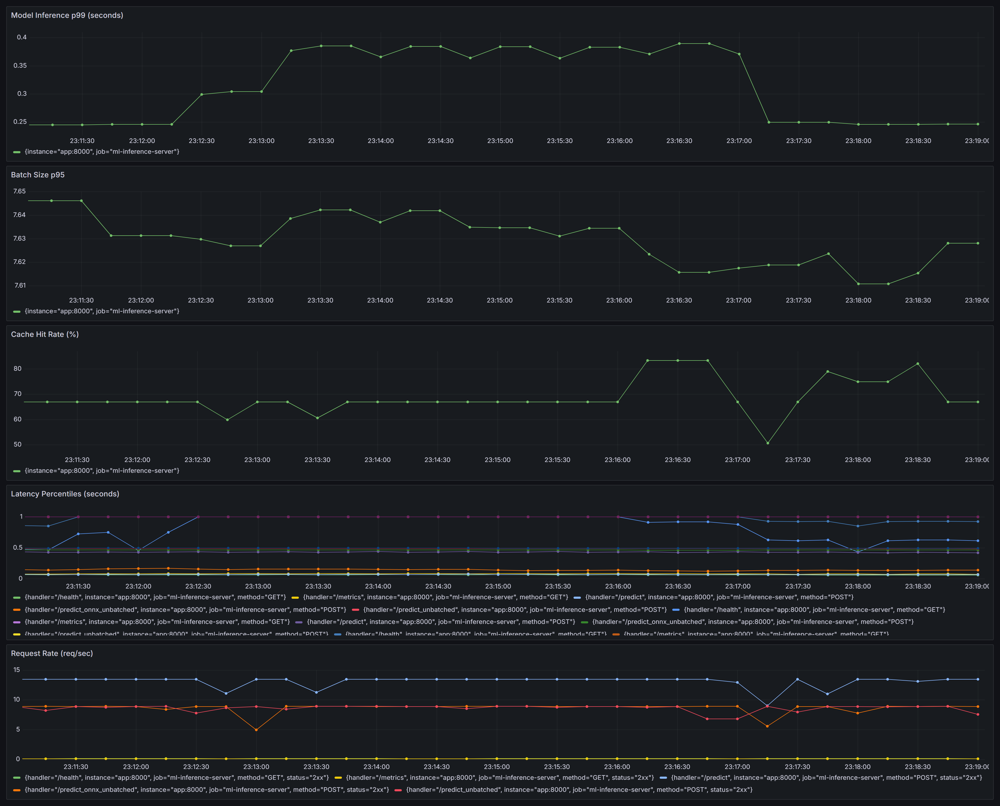

# ML Inference Server

Production-shaped sentiment inference on CPU: ONNX INT8, request batching, Redis cache-aside, Prometheus metrics, and a circuit breaker — with every performance claim measured rather than assumed.


DistilBERT SST-2 served behind an async batching layer, quantized to INT8, cached, instrumented, and load-shedding. It runs on a laptop CPU with no GPU, and the interesting output isn't the feature list — it's that a correctness audit invalidated three of this project's own earlier conclusions, which are documented below alongside the numbers that replaced them.



---

## Results

Measured on Windows 11, Intel i5-12450H (4 performance + 4 efficiency cores), no GPU. Server-side handler time reported separately from client-observed latency throughout.

| Change | Result | Notes |
|---|---|---|
| ONNX INT8 vs PyTorch FP32 | **8.2 ms vs 20.9 ms — 2.56x** | 4.46x at p99. Interleaved arms, equal padding |
| Quantization alone (INT8 vs FP32, same graph) | **~2.4–2.7x** | Isolates quantization from the runtime swap |
| Model size | **256.1 MB → 64.7 MB (−75%)** | FP32 → INT8 dynamic |
| Cache hit vs calibrated miss | **~2.9 ms vs ~37–48 ms (~13x)** | ~0.86 ms server-side under load |
| Batching throughput, cache bypassed | **1.01x — no gain** | Genuine CPU finding, explained below |
| Circuit breaker rejection vs a queued call | **0.015 ms vs ~20 ms (~1300x)** | Why the gate sits at admission |

**The batching result is the honest one.** Batching is supposed to be the headline win, and on this hardware it isn't. There's no kernel-launch overhead to amortize without a GPU, so the 20 ms collection window is close to pure added latency: p50 tail latency is ~5x worse batched, p99 ~2.2x worse, for a 1.01x throughput change. The batcher stays in because it bounds concurrency against the model — not because it made anything faster here. On a GPU the same code would tell a different story, and that's the point of measuring instead of assuming.

**Not re-baselined inside Docker.** Every number above was taken with uvicorn on the host. Reaching a container goes through the WSL2 port forward, which adds a hop the host measurements don't have, so container numbers aren't comparable and haven't been substituted in.

---

## Quick start

```bash
docker compose up -d --build
```

Four services come up: the API, Redis, Prometheus, and Grafana. The image exports and validates the ONNX graph during the build, so first build takes a few minutes; after that startup is ~30 s (the app loads both backends and runs a real 2-row forward pass before serving).

```bash
curl -s localhost:8000/health
```

```bash
curl -s -X POST localhost:8000/predict -H "Content-Type: application/json" -d "{\"text\": \"this movie was surprisingly good\"}"
```

```json
{ "label": "POSITIVE", "score": 0.9998, "latency_ms": 12.4 }
```

| Service | URL |
|---|---|
| API | http://localhost:8000 |
| Interactive docs | http://localhost:8000/docs |
| Prometheus | http://localhost:9090 |
| Grafana | http://localhost:3000 (admin / admin) |

`app/` is copied into the image, so **after editing source you need `--build`** — plain `docker compose up -d` sees an unchanged image and leaves the old container running. Tear down with `docker compose down`, or `-v` to also drop the Grafana volume.

### Requirements

Docker Desktop is all you need for the stack. For host development: Python 3.13, Redis reachable at `REDIS_URL`, and `python export_onnx.py` to generate `models/` (gitignored — ~320 MB).

---

## Architecture

```
                          HTTP request
                               │
                     ┌─────────▼─────────┐
                     │  FastAPI (async)  │
                     └─────────┬─────────┘
                               │
                      ┌────────▼────────┐   hit   ┌────────────────┐
                      │   Redis cache   ├────────►│  ~2.9 ms reply │
                      │  (fails open)   │         └────────────────┘
                      └────────┬────────┘
                               │ miss
                     ┌─────────▼─────────┐  OPEN  ┌────────────────┐
                     │  Circuit breaker  ├───────►│ 503 in 0.015ms │
                     │  (admission gate) │        └────────────────┘
                     └─────────┬─────────┘
                               │ admitted
                     ┌─────────▼─────────┐
                     │      Batcher      │  asyncio.Queue
                     │  ≤8 / 20 ms window│  Semaphore(4)
                     └─────────┬─────────┘
                               │
                     ┌─────────▼─────────┐
                     │ ONNX Runtime INT8 │  ← batch-safety probed at startup
                     │ (PyTorch fallback)│
                     └─────────┬─────────┘
                               │
                        Prometheus ──► Grafana
```

The ordering matters and is not the obvious one. **Cache before breaker** means a dead model still serves everything it has already answered. **Breaker before the queue** means a rejection costs 0.015 ms instead of waiting out a 20 ms batching window it was never going to survive.

The backend isn't configured — it's **resolved at startup by a real 2-row forward pass**. If the ONNX graph's batch axis came out baked rather than symbolic, the probe fails and the batcher falls back to PyTorch. `/health` reports whichever one actually won, because a silent fallback to a 2.56x slower path is the kind of bug that passes every check.

---

## API

| Endpoint | Backend | Batched | Cached |
|---|---|---|---|
| `GET /health` | — | — | Reports backend, cache stats, breaker state |
| `GET /metrics` | — | — | Prometheus scrape target |
| `POST /predict` | resolved at startup | Yes | Yes |
| `POST /predict_unbatched` | PyTorch FP32 | No | No |
| `POST /predict_onnx_unbatched` | ONNX INT8 | No | No |

The two `_unbatched` routes exist as measurement baselines, not as product surface. Keeping them is what makes every comparison in the results table reproducible against a running server rather than a benchmark script's private code path.

Request is `{"text": "..."}`; response is `{"label", "score", "latency_ms"}`. `/predict` returns **503** when the breaker is open — distinguishable from a 500, so a client can tell deliberate load-shedding from an unexpected fault.

---

## Engineering decisions

**Batching is bounded concurrency, not throughput.** `asyncio.Queue`, up to 8 requests per batch, 20 ms collection window, at most 4 batches in flight (`Semaphore(4)`). The semaphore is the load-bearing part: with 2 torch threads per batch on 12 logical cores, unbounded dispatch oversubscribes the CPU and every latency percentile degrades together.

**Cache-aside that fails open.** SHA-256 of the input text as the key, 1-hour TTL, writes fired off without awaiting them so a cache write never sits in the response path. If Redis is unreachable the server logs one warning and serves from the model. That's the right availability tradeoff and a measurement hazard — a fully healthy-looking server can be silently running the slow path — which is why Compose waits for Redis to answer `PONG` (`condition: service_healthy`) rather than merely to exist.

**The circuit breaker gates admission and records outcomes — it is not a wrapper.** Five consecutive failed batches opens it; after a 30 s cooldown exactly one probe is admitted, enforced by an explicit in-flight token rather than by state alone (a state check admits the entire arriving burst). `status()` deliberately does not claim that token, because `/health` is polled every 15 s by Docker's healthcheck and health polling that consumes the recovery probe means the breaker can never close. No lock: all three methods run on the single event loop with no `await`, so each is already atomic.

**One uvicorn worker, deliberately.** The batcher is in-process, so N workers means N independent batchers each filling at 1/N the request rate — smaller batches, same window — plus N × Semaphore(4) × 2 threads competing for 12 cores. It would also split the Prometheus registry, making `/metrics` report one arbitrary worker: a monitoring stack that is confidently wrong, which is worse than one that's missing. Scaling out needs `PROMETHEUS_MULTIPROC_DIR` and a batcher that doesn't assume a single process.

**ONNX export runs at image build time, and gates the build.** `models/` is gitignored and the app falls back to PyTorch silently, so an image built without the export would come up healthy and be 2.56x slower with nothing in the logs. The export script exits non-zero if the batch axis came out baked or if batch 1 and batch 4 disagree — turning two historical bugs into build failures instead of runtime surprises.

**`pip install torch` is the wrong 2.5 GB on Linux.** It resolves to the CUDA build by default; the Windows dev machine defaults to CPU, so the problem appears the moment you containerize, with no change to `requirements.txt`. Torch is installed first from the CPU index as its own layer, because both indexes publish the same version and letting pip choose isn't deterministic.

---

## The correctness audit

Midway through, I stopped adding features and audited the measurements instead. **Three of this project's own documented findings turned out to be measurement artifacts**, and fixing the harness exposed a real bug the broken harness had been hiding.

| Bug | Effect | Fix |
|---|---|---|
| ONNX exported with a batch-size-1 dummy input | Tracing baked the batch axis instead of leaving it symbolic — the "batched" path couldn't take a batch | Export with ≥2 rows, then assert the axis is dynamic |
| Tokenizer padded to a fixed `max_length` for serving | Every short input did full-length work; **this was the bug misdiagnosed as a quantization problem** | `padding=True` — pad to the batch's longest, matching the PyTorch pipeline |
| `_run_batch()` awaited inline in the collection loop | Batch dispatch was serialized. One batch was ever in flight, which is the batcher's entire purpose undone | Concurrent dispatch, semaphore-bounded |
| A fresh Redis client constructed per call | **9.58 ms vs 0.31 ms** per call | Module-level singleton |

The discipline that caught three of the four was reporting **server-side handler time separately from client-observed time** in every benchmark. Once those diverge, you know the harness is measuring itself. The other correction was interleaving comparison arms rather than running them in blocks — the same PyTorch call recorded 17.8 ms in one run and 31.7 ms in another purely from which core the scheduler picked, and on a hybrid P-core/E-core CPU block-structured benchmarks quietly compare schedulers instead of code.

This is also why the results table above carries methodology notes rather than just numbers.

---

## Failure modes

| Failure | Behavior |
|---|---|
| Redis unreachable | Fails open — one warning, then every request served from the model. Visible in `/health` and the cache-hit-rate panel |
| ONNX graph missing or batch-unsafe | Startup probe fails, batcher falls back to PyTorch, `/health` reports the real backend |
| Model raising repeatedly | Breaker opens after 5 consecutive failed batches; subsequent requests get 503 in ~0.015 ms; cache hits keep serving |
| Backend recovers | One probe admitted after 30 s; success closes the breaker, failure re-opens it with a fresh cooldown |
| Load beyond capacity | `Semaphore(4)` applies backpressure at the batcher rather than oversubscribing the CPU |
| Container shutdown | Task cancellation raises `BaseException`, deliberately not caught as a model failure — a graceful stop must not trip the breaker |

---

## Observability

`GET /metrics` exposes, alongside the standard HTTP histograms:

| Metric | Type | Purpose |
|---|---|---|
| `ml_model_inference_seconds` | Histogram | Model time only, excluding queue wait |
| `ml_batch_size` | Histogram | Whether batches actually fill, or time out at 1–2 |
| `ml_cache_hits_total` / `ml_cache_misses_total` | Counter | Hit rate, and whether a benchmark is measuring the cache by accident |
| `ml_circuit_breaker_state` | Gauge | `0` closed, `1` half-open, `2` open — encoded by severity so `max()` across instances is the worst state and an alert is a threshold, not a string match |
| `ml_circuit_breaker_rejections_total` | Counter | Requests shed, distinct from requests failed |

Grafana persists to a named volume, so dashboards survive `docker compose down`. Provisioning them from JSON is the better answer and is deliberately not done yet — the volume is the honest intermediate step.

---

## Project structure

```
app/
  main.py             FastAPI app, startup backend resolution, routes
  model.py            PyTorch FP32 backend — baseline and fallback
  model_onnx.py       ONNX Runtime INT8 backend
  batcher.py          asyncio batching + breaker admission gate
  cache.py            Redis cache-aside, singleton client
  circuit_breaker.py  CLOSED / OPEN / HALF_OPEN, one-probe recovery
  metrics.py          Prometheus metric definitions
export_onnx.py        Export + INT8 quantize + validate (build gate)
benchmark_onnx.py     ONNX vs PyTorch, interleaved
benchmark_batch_sizes.py  Batch-size sweep
load_test.py          Concurrent load, cache warm
load_test_nocache.py  Concurrent load, unique inputs — cache bypassed
test_requests.py      API smoke checks
test_cache.py         Cache behavior
test_circuit_breaker.py   Breaker state machine, injected instance
Dockerfile            Two-stage; exports and validates ONNX in the builder
docker-compose.yml    api + redis + prometheus + grafana
requirements.lock.txt Pinned to the exact versions every number was measured on
```

`requirements.txt` stays unpinned for host development; the image installs the lock file. The pinning is deliberate — the audit findings are properties of particular versions (the `dynamo=True` export default, a shape-inference conflict in `onnxruntime` 1.27, tokenizer padding behavior), so floating them means the documented results stop reproducing.

---

## Configuration

| Variable | Default | Effect |
|---|---|---|
| `REDIS_URL` | `redis://localhost:6379` | Compose sets `redis://redis:6379` |
| `HF_HOME` | `/opt/hf` in the image | Model snapshot is baked in; must be writable, since `huggingface_hub` takes file locks even on a pure read path |
| `HF_HUB_OFFLINE` | `1` in the image | Makes "never pull at runtime" explicit rather than incidental |

Batcher and breaker tuning (`batch_size=8`, `timeout_ms=20`, `max_concurrent_batches=4`, `failure_threshold=5`, `cooldown_seconds=30`) is passed at construction in `app/main.py`, kept together where a reader looks for it.

---

## Testing

```bash
python test_requests.py          # API contract
python test_cache.py             # hit/miss, TTL, fail-open
python test_circuit_breaker.py   # state machine, 6 checks, no production edit
```

The breaker test injects its own `CircuitBreaker(failure_threshold=2, cooldown_seconds=2)` and a `predict_fn` that raises, because `InferenceBatcher` takes the breaker as a constructor parameter. No temporary edits to shipped code, and nothing left behind that could trip in production.

**Current gap:** these are standalone scripts with hand-rolled assertions, and some require a live server. Converting them to pytest with unit/integration markers — so the unit half can run in CI without a server — is the top item on the list below.

---

## Limits and non-goals

Stated explicitly rather than left to be discovered:

- **One model, no registry.** No versioning, A/B routing, or canary rollout. This is an inference server, not a serving platform.
- **One process.** Horizontal scaling needs multiprocess Prometheus and a batcher that doesn't assume a single process — see the worker discussion above.
- **No auth, rate limiting, or request timeouts.** Fine behind a gateway; not fine on the open internet.
- **CPU-only findings.** The batching result in particular is hardware-specific and would likely invert on a GPU.
- **Container performance unmeasured.** Deferred deliberately rather than approximated from host numbers.
- **Dashboards not provisioned as code.** They survive teardown via a volume, but aren't in version control.

### Next

1. pytest + GitHub Actions, so the verification is repeatable by someone who isn't me
2. Re-baseline inside the container with a methodology that accounts for the port-forward hop
3. Recover ~336 MB of image: `docker history` shows a `chown -R` step duplicating the baked model cache into a new layer, which `COPY --chown` avoids
4. Grafana dashboards provisioned from JSON
5. Drop torch from the runtime image — the ONNX path needs only `onnxruntime` and a tokenizer, at the cost of the fallback and the baseline

---

## License

MIT — see [LICENSE](LICENSE).
